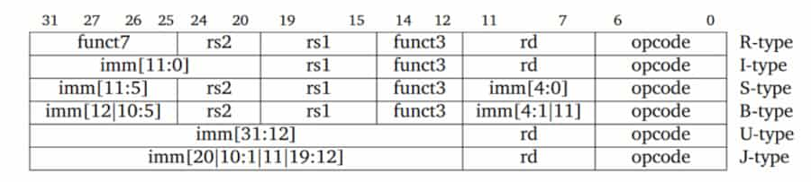

An open-standard ISA based on established RISC principles. Open source. Modular by design. Denoted as <b>RV32I</b> or <b>RV64I</b>, where the numbers represent the bit width of the registers and the address bus. Here only 32-bit instructions are explained.

### Key Characteristics

- Modularity: RISC-V has a small base integer instruction set (RV32I/RV64I) with optional extensions (M for multiplication, F/D for floating-point, etc.)
- Simplicity: Clean design with fixed-length 32-bit instructions (in the base encoding)
- Scalability: Supports various implementation sizes from embedded microcontrollers to high-performance computing

### Memory Addressing

RISC-V uses a load-store architecture where only specific load and store instructions can access memory. All other operations work directly on the registers.

### Extensions

The base RISC-V architecture is designed to be minimal and easy to implement. As not all implementations require integer multiplication, division and other functionality, they are extracted into extensions.

| Extension | Description                         | Instructions Count |
| --------- | ----------------------------------- | ------------------ |
| <b>I</b>  | Base                                | 51                 |
| <b>M</b>  | Integer multiplication and division | 13                 |
| <b>A</b>  | Atomic operations                   | 22                 |
| <b>F</b>  | Single-precision floating-point     | 30                 |
| <b>D</b>  | Double-precision floating-point     | 32                 |
| <b>C</b>  | Compressed instructions (16-bit)    | 36                 |
| <b>G</b>  | Same as <b>MAFD</b>                 | 97                 |
| <b>B</b>  | Bit manipulation                    | ?                  |
| <b>N</b>  | User level interrupts               | ?                  |

Proprietary extensions can also be developed.

Eventhough multiplication and division are not-so-complex from mathematical view, they require more silicon area, and thus more power. That's why the <b>M</b> extension is made.

The `misa` register can be used to query which extensions are implemented in the processor.

### Register Conventions

Has 32 registers. Each register is numbered from x0 to x31. Each one also has an assigned name.

| Register  | ABI Name | Description                      |
| --------- | -------- | -------------------------------- |
| `x0`      | `zero`   | Hardwired to 0                   |
| `x1`      | `ra`     | Return address                   |
| `x2`      | `sp`     | Stack pointer                    |
| `x3`      | `gp`     | Global pointer                   |
| `x4`      | `tp`     | Thread pointer                   |
| `x5-x7`   | `t0-t2`  | Temporaries                      |
| `x8`      | `s0/fp`  | Saved register/frame pointer     |
| `x9`      | `s1`     | Saved register                   |
| `x10-x11` | `a0-a1`  | Function arguments/return values |
| `x12-x17` | `a2-a7`  | Function arguments               |
| `x18-x27` | `s2-s11` | Saved registers                  |
| `x28-x31` | `t3-t6`  | Temporaries                      |

## Instructions

All instructions are 32 bits wide. All the instructions are encoded in different formats. All instructions have an opcode of 7 bits wide.

### Instruction Types

### R-type

Register-register operations. Input is 3 registers.

The instruction format:

| Section  | Width (bits) | Description                              |
| -------- | ------------ | ---------------------------------------- |
| `funct7` | 7 [31:25]    | Operation subtype (e.g., `ADD` vs `SUB`) |
| `rs2`    | 5 [24:20]    | Second source register                   |
| `rs1`    | 5 [19:15]    | First source register                    |
| `funct3` | 3 [14:12]    | Instruction variant                      |
| `rd`     | 5 [11:7]     | Destination register                     |
| `opcode` | 7 [6:0]      | Operation code                           |

### I-type

Immediate operations. Input is 2 registers and an immediate value. Immediate value is 12 bits wide, sign-extended.

| Section     | Width (bits) | Description              |
| ----------- | ------------ | ------------------------ |
| `imm[11:0]` | 12 [31:20]   | Immediate value (signed) |
| `rs1`       | 5 [19:15]    | Source register          |
| `funct3`    | 3 [14:12]    | Instruction variant      |
| `rd`        | 5 [11:7]     | Destination register     |
| `opcode`    | 7 [6:0]      | Operation code           |

### S-type

Store operations, from register to memory.

The instruction format:

| Section     | Width (bits) | Description                          |
| ----------- | ------------ | ------------------------------------ |
| `imm[11:5]` | 7 [31:25]    | Offset bits [11-5]                   |
| `rs2`       | 5 [24:20]    | Register containing the target value |
| `rs1`       | 5 [19:15]    | Register containing the base address |
| `funct3`    | 3 [14:12]    | Instruction variant                  |
| `imm[4:0]`  | 5 [11:7]     | Offset bits [4-0]                    |
| `opcode`    | 7 [6:0]      | Operation code                       |

Immediate value is sign-extended. Used as the offset to the target memory address. Split into 2 parts to make sure the instruction format is aligned as much as possible with other instructions.

As both the instruction size and the address bus size are 32 bits wide, the target memory address cannot be included in 1 instruction. That is why this method is being used. This method also provides the local usage functionality.

### B-type

Conditional branch operations. Similar to jumps, but for temporary jumps.

Memory is byte-addressable. Instructions can only start from addresses that are multiples of 4 (otherwise it would be complex and slower). As branch targets must point to instructions, the target memory address must be aligned to a multiple of 4, which means the 2 LSBs are always 0. When compressed instructions are used, the target memory address must be aligned to a multiple of 2.

To improve the branch range, the LSB, which is always 0, is not stored in the instruction. When actually executing the instruction, the target address is multiplied by 2.

### U-type

Upper immediate operations.

The instruction format:

| Section      | Width (bits) | Description            |
| ------------ | ------------ | ---------------------- |
| `imm[31:12]` | 20 [31:12]   | 20-bit immediate value |
| `rd`         | 5 [11:7]     | Destination register   |
| `opcode`     | 7 [6:0]      | Operation code         |

Handle large immediate values (20 bits). Used for `LUI` (Load Upper Immediate) to set the upper 20 bits of a register and `AUIPC` (Add Upper Immediate to PC) for PC-relative addressing. These instructions enable efficient address calculation and large constant loading.

### J-type

Used for unconditional jump operations. Similar to branch operations, but used for long range. Has an unintuitive instruction format for better performance.

The instruction format:

| Section      | Width (bits) | Description              |
| ------------ | ------------ | ------------------------ |
| `imm[20]`    | 1 [31]       | MSB of offset (sign bit) |
| `imm[10:1]`  | 10 [30:21]   | Midle bits of offset     |
| `imm[11]`    | 1 [20]       | Another bit of offset    |
| `imm[19:12]` | 8 [19:12]    | Upper bits of offset     |
| `rd`         | 5 [11:7]     | Destination register     |
| `opcode`     | 7 [6:0]      | Operation code           |

Enables 20-bit signed offsets (multiplied by 2), allowing jumps to targets further away than B-type branches. The immediate bits are arranged in a non-sequential order to simplify hardware implementation. The most significant bit is placed at bit 31 for efficient sign extension, and the remaining bits are organized to maximize compatibility with other instruction formats.

Like B-type instructions, the least significant bit of the target address is omitted as it must be 0 (instructions are aligned on even byte boundaries when using compressed instructions, or 4-byte boundaries otherwise). The jump offset is sign-extended and added to the PC to form the jump target address.

## Important Design Decisions

### Instruction format

Instructions of RISC-V are designed to follow maximum commanility.

- Opcode is always last 7 bits.
- When required, `rd` is always last 5 bits.
- If `rd` is not required, a subset of `imm` is stored there.
- When `imm` is required, its MSB is stored in the instruction's MSB.  
  Reason: to improve performance in sign extension

## Instruction Execution

RISC-V instructions can be executed in at most 5 clock cycles.

### Instruction Fetch (IF)

Send the program counter (PC) to memory and fetch the current instruction from memory. Update the PC to the next sequential instruction by adding 4 (because each instruction is 4 bytes) to the PC.

| Instruction Type | Required CC |
| ---------------- | ----------- |
| Branch           | 3           |
| Store            | 4           |
| Other            | 5           |

### Instruction Decode (ID)

Both of the operations are performed in parallel:

- Decode the instruction
- Read the specified registers  
  Equality test on registers are done as they are read. The register might be unused, but it doesn’t hurt performance. Power is wasted though. Power-sensitive designs might avoid this.
- Offset is sign-extended  
  The immediate field is always in the same place, so sign-extension is straightforward. Possible branch target is computed by adding the sign-extended offset to the incremented PC.

Decoding is done in parallel with reading registers. It's possible because
the register specifiers are at a fixed location in a RISC architecture. This tech-
nique is known as fixed-field decoding.

### Execution/effective address cycle (EX)

In this step, only one of the following tasks is performed:

- Effective address is calculated (base register + offset) OR
- Other ALU operation is performed based on the instruction type
  - For Register-Register ALU instruction  
    The ALU performs the operation specified by the ALU opcode on the values read from the register file.
  - For Register-Immediate ALU instruction  
    The ALU performs the operation specified by the ALU opcode on the first value read from the register file and the sign-extended immediate.
  - For Conditional branch instruction  
    Determine whether the condition is true.

The reason is RISC-V is load-store architecture. No instruction needs to simultaneously calculate a data address and perform an operation on the data.

### Memory access (MEM)

Skipped unless the instruction is either a load or a store.

- For a load: the memory does a read using the effective address computed in the previous cycle
- For a store: the memory writes the data from the second register

### Write-back cycle (WB)

Write result back to destination register. Skipped for store and branch/jump instruction.

- For an ALU instruction
  The ALU’s output is written.
- For a load instruction
  The data fetched from memory in MEM stage is written.

:::note

I have created a [short note on Addressing Modes in RISC-V](/notes/Addressing%20Modes%20RISC-V.pdf) for quick reference.

:::
