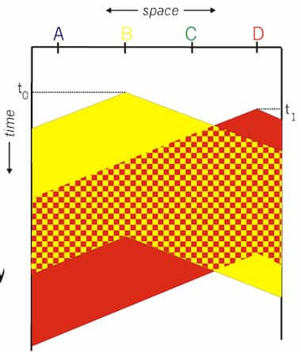

## Link

A physical (wires, wireless) or logical (established over multiple links) connection between two devices, which carries data.

2 types:
- Point to Point (aka. P2P) - Direct connection between two devices.
- Broadcast - Connection between multiple devices using a shared link.

### Collision

When a node receives more than 1 signal at the same time.

## Multiple Access Protocol

A distributed algorithm that determines how nodes share a channel. Channel control communication must use the channel itself.

An ideal multiple access protocol has the following properties, given a broadcast channel of rate $R\,\text{bps}$:
- when one node wants to transmit, it can send at rate $R$.
- when $M$ nodes want to transmit, each can send at average rate $R/M$.
- fully decentralized
  - no special node to coordinate transmissions   
  - no synchronization of clocks, slots
- simple

Has 3 classes.

### Channel partitioning

Channel is divided into smaller _pieces_ (time slots, frequency, code). Each piece is allocated to each node for exclusive use.

#### TDMA

Short for Time Division Multiple Access. The channel is accessed in rounds. Each station gets fixed time length (package transmission time) slot. Unused slots go wasted. No collisions. Efficient use. Easier synchronization.

Used in 2G cellular networks.

#### FDMA

Short for Frequency Division Multiple Access. Channel is divided into smaller frequency bands. Each station is allocated a specific frequency band. Transmission is simultaneous. No collisions. Can only support fixed number of users, based on the available bandwidth. Unused transmission time in frequency bands go idle.

Guard bands, which are small frequency bands between the allocated bands, are used to prevent interference between adjacent channels. Guard bands waste bandwidth.

Used in 1G cellular networks.

### Random access

Devices transmit when they have data. Collisions are possible. Requires recovery.

When a node has packets to send   
- transmit at full channel data rate $R$
- no a priori coordination among nodes

High chance for collisions. Collision detection and recovery are essential.

Examples:
- ALOHA
- slotted ALOHA
- CSMA, CSMA/CD, CSMA/CA

#### CSMA

Short for Carrier Sense Multiple Access. Nodes listen before transmitting. If channel is idle, they transmit. If channel is busy, transmission is deferred. Collisions can occur.

<figure>

<figcaption>

Image from lecturer's slides

</figcaption>
</figure>

In the above example, $D$ starts transmission as propogation delay caused it to collide. Collision is only detected after the stations have already sent overlapping signals. Packets have to be retransmitted. Whole transmission time is wasted.

#### CSMA/CD

Short for Carrier Sense Multiple Access with Collision Detection. Short time collision detection. Colliding transmissions are aborted, reducing channel wastage.

Collision detection is easy in wired LANs: measure transmitted, received signal strengths and compare. Difficult in wireless LANs: received signal strength is overwhelmed by local transmission strength.

### Taking Turns

Nodes take turns to access the medium. Nodes with more to send can take longer turns.

#### Polling
 
_Master node_ polls _slave nodes_ to transmit in turn. Only the currently polled station can transmit. Simple. No collisions. Good for small networks with predictable traffic.

Even when a station is idle, it will be polled, causing additional delays. Has single point of failure (master).

Typically used with _dumb_ slave devices.

Concerns:
- polling overhead
- latency

#### Token passing

Token is a special frame, which circulates around the network. Onlt the token-holding station can transmit. No collisions. No central controller is required.

Token passing adds time overhead for transmission. Single point of failure (token). Requires token recovery mechanism.

## MAC Address

Aka. LAN or physical or ethernet address. A 48-bit address (for most LANs), burned in NIC ROM, also software-settable in some cases, for the privacy reasons. Used _locally_ to get frame from one interface to another physically-connected interface (same network, in IP-addressing sense). Used in Link layer.

Different from IP address, which is 32-bit and used in network layer.
