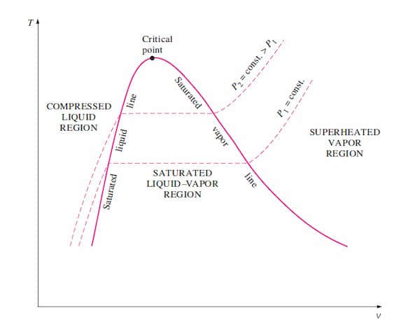
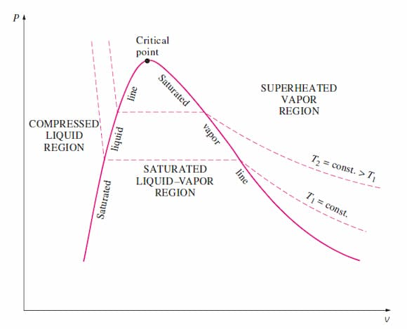
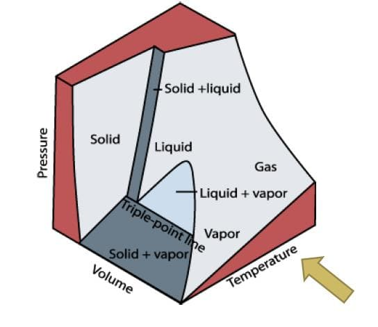
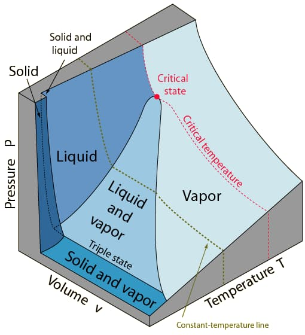

## P-T Diagram

### Saturation Dome

Region on [T-v diagram](#tv-diagram) or [P-v diagram](#pv-diagram) bounded by saturated liquid line (left) and saturated vapour line (right).

The mixture region lies under the dome.

## Phase Diagram

A graph of pressure vs. temperature. Represents the conditions under which a substance exists in a each phase.

### Fusion line

Boundary line between solid and liquid phases. Represents the conditions at which a substance melts or freezes.

### Evaporation line

Boundary line between liquid and gas phases. Represents the conditions under which a substance boils or condenses.

### Sublimation line

Boundary between the solid and gas phases. Represents the conditions under which a substance sublimes (solid to gas) or deposits (gas to solid).

### Critical line

The line that ends at the critical point, beyond which the liquid and gas phases become indistinguishable; it represents the highest temperature and pressure at which a liquid and its vapor can coexist.

### Critical point

A unique set of temperature and pressure at which the distinction between liquid and gas phases disappears. Denoted as ($T_c$, $P_c$). Here $T_c$ is the critical temperature and $P_c$ is the critical pressure.

Above the critical point, the substance exists as a [supercritical fluid](#supercritical-fluid).

### Triple point

A unique set of temperature and pressure at which all 3 phases of a substance coexist in equilibrium.

## T–v Diagram

Graph of temperature vs. specific volume. Used to visualize phase changes at a given pressure. Temperature remains constant under the dome.

<figure>

<figcaption>

Image from lecturer's slides

</figcaption>
</figure>

- In compressed liquid region: temperature rises with small volume change.
- At saturated liquid line: temperature fixed at $T_\text{sat}$; boiling begins.
- Under the dome: temperature constant; volume increases as $x$ increases.
- At saturated vapour line: phase change complete.
- In superheated region: both temperature and volume rise.
- Critical point is the peak of the dome.

### Isobar

Line of constant pressure. Bend upward.

## P–v Diagram

Graph of pressure vs. specific volume. Used to visualize phase change at a given temperature. Pressure remains constant under the dome.

<figure>

<figcaption>

Image from lecturer's slides

</figcaption>
</figure>

Saturation dome similar to T–v diagram but curved differently.

Under the dome: mixture region with constant-pressure lines.

- During boiling at fixed temperature: pressure stays constant.
- Specific volume increases sharply across the mixture region.
- The flat segment length relates to the latent heat.

### Isotherm

Line of constant temperature. Bend downward.

- At $T < T_c$: isotherm cuts across dome in a horizontal line, representing constant-pressure phase change.
- At $T > T_c$: no flat region; fluid behaves as a supercritical gas.

P-v diagrams are mostly used to visualize isothermal processes. Constant-temperature lines help interpret behaviour of real fluids compared to ideal gases.

## P-v-T Surface

### Substance that contracts on freezing

<figure>

<figcaption>

Image from lecturer's slides

</figcaption>
</figure>

### Substance that expands on freezing

<figure>

<figcaption>

Image from lecturer's slides

</figcaption>
</figure>
