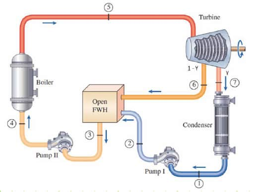
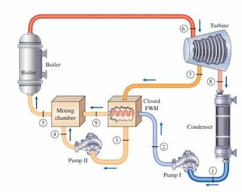

This is a step further closer to the real operation of steam power plants because using regeneration, we are trying to increase performance further and modern steam power plants are generally equipped with regeneration together with reheating. If you look at the T.S. diagram of this rankine cycle, you can see heat transfer in the boiler starts from a very low temperature at state 2. This makes the average temperature of heat transfer to the workin fluid which is the steam takes place at relatively low temperature. Consequently the efficiency is low compared to the Carnot cycle. If we can preheat the feed water before it enters the boiler then the low value of the temperature where the heat transfer happens inside the boiler increases. Perhaps it might be starting from here. Consequently the average temperature of heat transfer increases. and then the efficiency of the cycle increases.

## Preheating

The process of heating the feedwater before it enters the boiler. Steam is extracted from the turbine at a certain pressure and used here. Aka. regeneration.

Increases the thermal efficiency. Reduces fuel consumption. The cost of power generation decreases.

The steam consumption is slightly increased as a consequence of extracting some of the steam halfway through the expansion process.

And also it is better for the bider because if you are supplying fairly low temperature feed water to the bider, the thermal gradient where the bider experiences is fairly high. Therefore, it is not quite healthy. the oil. With the preheating you increase the temperature of the entering feed water to the oil. Therefore, the thermal gradient where the oil experiences is relatively less.

## Feedwater Heater

The heat exchanger used in this system. Aka. regenerator. 

### Open Feedwater Heater

<figure>

<figcaption>

Image from [Engineer's Edge](https://www.engineersedge.com/thermodynamics/steady_flow_vapor_power_cycle_15976.htm).

</figcaption>
</figure>

Simply a mixing chamber.

Extracted steam and condensed feedwater must be in the same pressure. Feedwater is compressed to match the pressure. Then the mixture has to be pumped to the boiler pressure.

Easy for construction. Has better heat transfer performance.

Several number of pumps are required. In a power plant with multiple feedwater heaters, large number of pumps will be required.

Here at state 6 you extract a steam from the turbine while it was half way expanding through the turbine and then the feed water which is coming after the condensation is fed into the open feed water heater. The extracted steam and the feed water mix inside the open feed water heater and then the mixture is from back to the boiler pressure and the feed water is sent to the boiler. 

This is the schematic diagram of the power plant with a single open feed water heater and this is the corresponding T s diagram. Why quantity of a y fraction of steam is extracted at state 6 which is denoted here? It transfers heat to the feed water until steam is fully condensed. That is until it reaches state 3. say 3 is saturated liquid at this particular pressure. Once you extract white fraction of steam for the feed water heater the remaining portion is 1 minus 1 because here we are dealing with specific quantities. If 1 kilogram of steam is coming from the boiler 1 minus y quantity is now going through the condenser along this path. And that quantity is compressed here up to the pressure of the open feed water heater. Then the two fluids are mixing fluid at the state 6 and fluid at the state 2. In ideal scenario, temperature of state 3 is same as the temperature of the steam. But in practice, temperature at state 3 is slightly less than the temperature of the steam because there has to be some temperature difference in order for heat transfer to take place. But in the ideal scenario, the temperature at state 3 is identical to the temperature of the steam. And then the mixture is pumped to the boiler pressure and then across the boiler heat transfer takes place. Now you can see that the the heat transfer in the boiler start from states 4 and then in Z state 5 rather than starting from state 2. Therefore, the average temperature of the heat transfer has increased as a consequence of this preheating. Here I have considered only a single stage expansion for the simplicity, but in practice you have the multi-stage expansion with preheating. In fact, it is reheating and regeneration together. You can find the fraction of steam extracted from the turbine by applying the energy analysis to the open feed water heater. enthalpy comes in from state 6 steam plus the enthalpy comes in with feed water at state 2 must be equal to the enthalpy at state 3 as you mean no change of kinetic energy and no change of gravitational potential energy and also it is assumed the open feed water heater is perfectly insulated so therefore there is no heat transfer taking place obviously there is no work transfer as well therefore you can find the fraction of steam extracted from the turbine for feed water heating from this equation this is the amount of enthalpy the heat water. thermal power plant having one closed feed water heater is shown here. Together with its TS diagram. As you can see like in the open feed water heater here also, why fraction of steam is extracted from the turbine half-fadeuring its expansion process at state 7 which is shown in the TS diagram here. This is the pressure of the air extracted steam. That steam is sent through the closed feed water heater. As you already learn, there is no mixing of the feed water and the steam. Therefore, close feed water heater can operate at a different pressure to the feed water. Feed water gains heat from the steam and in the ideal scenario at state 9, feed water We will have the same temperature of the steam. So, the temperature of the steam is identical to the temperature at the steam. That is the temperature of the steam. temperature at state 9 must be slightly less than the temperature at state 3. However, when the ideal scenario, we consider the two temperatures as identical. After feed water gains heat from the steam inside the close feed water heater, it is going into the mixing chamber to mix with the extracted steam. But as you can see from this diagram, feed water is now in the boiler pressure because after state 2 feed water is compressed to the boiler pressure however extracted steam is in the pressure of state 7 that means at this pressure therefore extracted steam has to be compressed to the boiler pressure before it enters the mixture in chamber. After mixing of feed water and the steam, the mixture leaves the mixing chamber at state 5. The actual power plant consists of several feed water haters. Usually about 6-7 feed water haters, some feed water haters are closed feed water haters whereas some others are open feed water haters. Trap is a device which throttle the steam extracted from the turbine to a lower pressure. So, you can mix with the other streams. Here you can see steam is extracted at four different pressures. So, there are multiple stages of feed water heating. Here the feed water or the condensate from the condenser has to be compressed to the pressure of the open feed water heater because there is a mixing happen here and there are after mixture is compressed to the boiler pressure through this pump. There are other components like de-reating circuits as well as the feed water tank etcetera because de-reating is important process which removes non-condensable gases. The common non-condensable gases in steam are oxygen and carbon dioxide both contributes to corrosion of the boiler. Oxygen directly contributes and carbon dioxide make water acidic. Therefore it contributes for corrosion of the boiler. Therefore those gases has to be removed. There are other components as well like the feed water tank which store certain volume of feed water because in certain situation demand increases before the condenser is providing feed water at the same rate. Therefore, there is a gap in the feed water supply. In such situations, the feed water tank can provide the balance of the feed water to the boiler.

### Closed Feedwater Heater

<figure>

<figcaption>

Image from [ResearchGate](https://www.researchgate.net/post/What_is_the_role_of_Mixing_Chamber_and_Steam_Trap_in_a_Closed_Feedwater_Heater_containing_Power_Plant).

</figcaption>
</figure>

Pressure of extracted steam and condensed feedwater need not be the same. Preheated feedwater mixes with the condensed feedwater.  

Requires less number of pumps.

Not as effective as open heat feed water heaters in terms of heat transfer characteristics.

In practice there are about 6 or 7 feed water heaters employed at different pressures.
