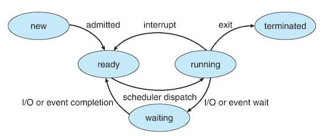

OS manages user-level and kernel-level processes, which includes creating, managing, scheduling and terminating.

A program in execution. An active entity. Program becomes active when it is loaded into memory. Instructions of a process are executed in sequence. Multiple processes can be associated with a single program.

A process contains:

- text section: the program code
- program counter
- CPU registers – current working values
- data section: global/static variables
- stack: function calls, return addresses, local variables.
- heap: dynamically allocated memory
- data section: containing global variables

Multithreaded processes have 1 program counter per thread.

### Program

A passive entity stored on disk. Aka. executable file.

### System Program

Programs that provide services to the user and the OS. Shipped with the OS. Not part of the kernal.

## Context

Complete set of information about a process, that is required to pause, and later resume it exactly where it left off. 

Includes: 
- process id, state
- parent process id
- program counter
- stack pointer
- register contents
- memory mappings
- open files (file descriptors)
- scheduler information such as priority, queue pointers
- I/O devices
- signal handlers
- accounting information such as CPU time used, memory usage, I/O operations
- other critical data

### Context Switching

The technique of saving the current process’s context and loading another process’s context. Required for multitasking. Introduces overhead.

### Process Control Block

Aka. PCB, task control block. Representation of a process' context.

#### Representation in Linux

```c
struct task_struct {
    pid t_pid; /* process identifier */
    long state; /* state of the process */
    unsigned int time_slice; /* scheduling information */
    struct task_struct *parent;/* this process’s parent */
    struct list_head children; /* this process’s children */
    struct files_struct *files;/* list of open files */
    struct mm_struct *mm; /* address space of this process */
}
```

## Process States



### New

When a process is being created. Resources are allocated and the process is prepared to be admitted to the ready queue.

### Ready

When a process is loaded into memory and ready to run.

### Running

When a process's instructions are being executed on a CPU.

### Waiting

Aka. blocked. When a process is waiting for an event or a resource. Waits in an event-specific queue until the condition is satisfied.

### Terminated

When a process has finished execution or been killed. Its resources are reclaimed and a cleanup is performed.

### Zombie

When process is in terminated state, but its exit status has not yet been collected by its parent. Once the parent collects the exit code (using `wait()` or `waitpid()`), the process entry is completely deleted.

### Orphan

When a parent process terminates before its child process. The orphaned child is adopted by the `init` process (PID 1).

## Process Scheduling

The procedure of choosing which process runs next. Handled by process scheduler. Maintains scheduling queues of processes.

### Ready Queue

For processes waiting to run.

### Wait Queues

For processes waiting on events (I/O).

Processes move across these queues continuously.

## Process Creation

### Parent–Child Model

A parent creates a child, forms a process tree. Parent and child may or may not share all or a subset of resources. Parent and child may run concurrently; or parent may wait for child to complete.

In UNIX:

- `fork()`   
  Duplicates current process. Returns 0 to child, child's PID to parent.
- `exec()`    
  Loads new program into process
- `wait()`   
  Parent waits for child to finish, retrieves exit status

## Process Termination

Mobile OS often have to terminate processes to reclaim system resources such as memory. From most to least important:
- Foreground process
- Visible process
- Service process
- Background process
- Empty process

### Normal termination

When a process finishes, it calls `exit()` to terminate itself. Its exit status is read using `wait()` by the parent.

### Abnormal termination

Parent may kill the child via `abort()`. Possible reasons for killing:

- Child exceeded resources
- Child’s task is unnecessary
- Parent itself is exiting

On some systems, the OS would kill the entire subtree when parent dies, which is called cascading termination.
