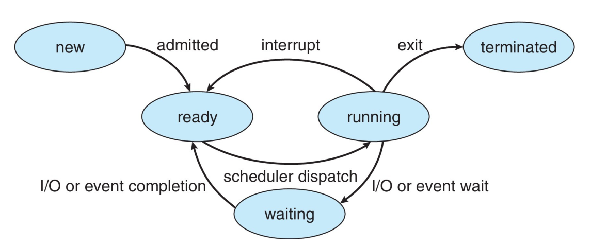

Operating system is responsible for creating, managing, scheduling and terminating processes, both user and kernel processes.

### Program

A passive entity stored on disk. Aka. executable file.

## Process

A program in execution. An active entity. Program becomes active when it is loaded into memory. Instructions of a process are executed in sequence. Has multiple parts:

- text section: the program code
- program counter
- stack: containing temporary information i.e. function parameters, return addresses, local variables
- heap: containing dynamically allocated memory
- data section: containing global variables

Multithreaded processes have 1 program counter per thread.
  
### Context

The information about a process that is used to track and manage its execution. This includes the process's Program Counter (PC), stack pointer, register contents, and other critical data. The OS saves the context when switching between processes (context switch) and restores it when the process resumes execution. Context switching is a computationally expensive operation that affects system performance.

### State



- New: The process is being created
- Running: Instructions are being executed
- Waiting: The process is waiting for some event to occur
- Ready: The process is waiting to be assigned to a processor
- Terminated: The process has finished execution

### Process Control Block

Aka. PCB, task control block. Information about a process. Contains:

- State
- Program counter
- CPU registers - contents of all process-centric registers
- Scheduler information such as priority, queue pointers
- Memory Address Space
- Accounting information such as CPU time used, memory usage, I/O operations
- I/O Devices
- Signal Handlers
- Process ID
- Parent Process ID
- File Descriptors

#### Representation in Linux

```c
struct task_struct {
    pid t_pid; /* process identifier */
    long state; /* state of the process */
    unsigned int time_slice; /* scheduling information */
    struct task_struct *parent;/* this process’s parent */
    struct list_head children; /* this process’s children */
    struct files_struct *files;/* list of open files */
    struct mm_struct *mm; /* address space of this process */
}
```


The process of selecting the suitable core from the available. To maximize CPU utilization. Handled by process scheduler. Maintains 2 queues:
- Ready queue: set of processes. residing in memory. ready to run. 
- Wait queue: set of processes waiting for an event.
